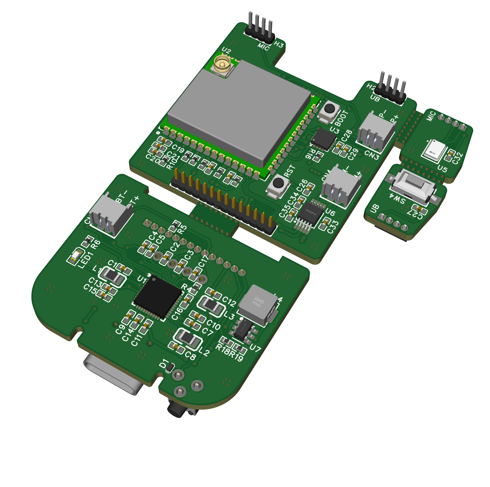

# Keero Bot Firmware



[](https://www.pcbway.com/)


Keero Bot firmware is the open-source software layer behind the Keero hardware platform.

Today, the most mature public part of the repository is the mobility-oriented `tracks` module firmware. It already demonstrates real motor, lighting, and power-management behavior on hardware, while the broader Keero mainboard firmware continues to evolve.

## Current Public Scope

The firmware repository currently communicates two things clearly:

- the full Keero platform firmware is still in progress
- the `tracks` module is already real, testable, and open source

That makes the repo useful both as a public engineering signal and as the software foundation for future mobility demos.

## Tracks Module

The `modules/tracks` firmware is the most concrete public implementation in the repo.

It covers:

- drive control for the mobility module
- lighting behavior
- battery monitoring and power-related logic
- serial command handling for integration and testing
- Arduino and PlatformIO-based development on ESP32-C3

This part is fully Keero-authored firmware and is intended to stay public.

The current public mobility setup also has a documented reference parts set for the chassis, pogo connection, and 3V motors so the open firmware story stays tied to a real, reproducible demo configuration.

## Origin and Attribution

The mobility module direction is inspired by the ESP-SparkBot project.

For that reason, Keero keeps the public mechanical references and credits visible instead of treating that part as a closed original design. The current Keero adaptation builds on that direction while moving the module toward the Keero platform architecture.

## What Keero Changed

The mobility PCB direction follows the general SparkBot-style tracks concept, but the Keero version was updated around the `ESP32-C3-WROOM-M2` so it works cleanly with:

- Arduino
- PlatformIO
- the current Keero firmware workflow

That means the public story is honest:

- the mobility concept did not start from zero
- the firmware stack and working C3-based adaptation are Keero work

## Repository Structure

```text
keero-firmware/
├── assets/
├── modules/
│   └── tracks/
│       ├── config/
│       ├── lib/
│       ├── src/
│       └── platformio.ini
├── mainboard/
└── README.md
```

## Development Notes

The public firmware emphasis is intentionally practical rather than overproduced.

Right now the repository is meant to show:

- credible embedded implementation work
- a real module bring-up path
- a software foundation that can expand into the broader Keero Bot system

## Status

- Full Keero mainboard firmware: coming soon
- Tracks module firmware: active and public
- Mobility module integration: working and evolving

## PCBWay Relevance

For sponsors and prototyping partners, the firmware repo matters because it proves the hardware project is not static.

It shows:

- a working software path for a real module
- iterative prototype readiness
- a credible route from electronics to behavior


